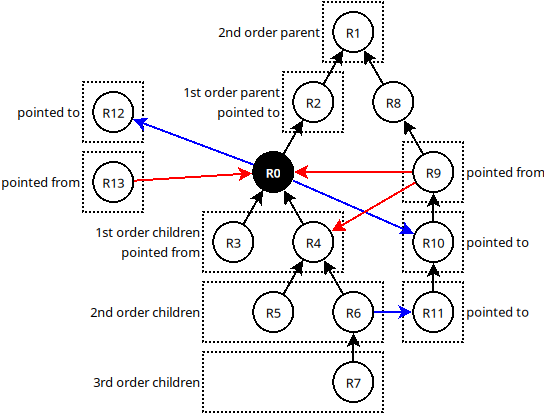

# Conventions

* RDF property URIs are quite often shortened using following prefixes:
  ```
  acdh https://vocabs.acdh.oeaw.ac.at/schema#
  acdhi https://id.acdh.oeaw.ac.at
  ```
* Examples are provided either in plain URLs or Python.
  In case of Python it's assumed `datetime`, `requests` and `rdflib` libraries are loaded in a following way:
  ```python
  import datetime
  import requests
  import rdflib
  ```
* The `{repoCfg}$.X.Y` syntax means an `$.X.Y` [JSON path](https://github.com/json-path/JsonPath) over the repository configuration returned by its [describe](https://app.swaggerhub.com/apis/zozlak/arche/3.5#/default/get_describe) REST API endpoint,
  e.g. `{repoCfg}$.schema.label` on https://arche.acdh.oeaw.ac.at/api resolves to `https://vocabs.acdh.oeaw.ac.at/schema#hasTitle`.
* The **ARCHE API** term means "the REST API provided by the [arche-core](https://github.com/acdh-oeaw/arche-core)" with its OpenAPI specification available [here](https://app.swaggerhub.com/apis/zozlak/arche/).
* The **_requested resource_** means both the resource requested by the [resource metadata](https://app.swaggerhub.com/apis/zozlak/arche/3.5#/default/get__resourceId__metadata) REST API endpoint **as well as** all resources matched by the search condition in the search REST API endpoints ([GET](https://app.swaggerhub.com/apis/zozlak/arche/3.5#/default/get_search) and [POST](https://app.swaggerhub.com/apis/zozlak/arche/3.5#/default/post_search) ones)

# Introduction

ARCHE Suite uses RDF metadata but doesn't provide an [SPARQL](https://en.wikipedia.org/wiki/SPARQL) endpoint^[There are many reasons for that starting from performance and hardware resources consumption though assuring data consistency up to ability to assure access rights. Discussing them is beyond the scope of this document.].

Instead of the SPARQL endpoint ARCHE Suite provides its own REST API (later on just "ARCHE API").
This API doesn't give you as much flexibility as SPARQL but is much simpler, delivers data much faster and covers most everyday use cases.

This document supplements the ([technical openAPI documentation](https://app.swaggerhub.com/apis/zozlak/arche/)) of the ARCHE API with practical examples illustrating its capabilities.

# Metadata retrieval performance

Maximizing metadata retrieval performance goes down to few simple rules:

* Make as few REST API requests as possible  
  (because each requests introduces network latency and constant processing overhead).
  * In ARCHE metadata API this is achieved by choosing the right metadata **readMode** parameter.
* Request as little data as needed
  (because large data sets take longer to serialize, transfer over the network and parse on your side).
  * In ARCHE metadata API this is achieved by choosing the right metadata **readMode** parameter and combing it with the **`resourceProperties`** and **`relativesProperties`** parameters.
* Request metadata in `application/n-triples` format because it's [definitely the fastest](metadata_api_performance.html) and if you think you can avoid parsing the RDF with a dedicated parser library by choosing the serialization format smartly (e.g. by requesting `application/json` or `application/ld+json`), then [you are wrong](rdf_basics.html).
  
## Examples and discussion

Let's compare two implementations of a "fetch https://arche.acdh.oeaw.ac.at/api/8274 title and last modification date and title of all resources it refers to" scenario:

1. First fetch the https://arche.acdh.oeaw.ac.at/api/8274 metadata,
   then fetch all resources it points to one-by-one:
   ```python
   t0 = datetime.datetime.now()
   response = requests.get('https://arche.acdh.oeaw.ac.at/api/8274/metadata?readMode=resource&format=application/n-triples')
   resMeta = rdflib.Graph()
   resMeta.parse(data=response.text, format='nt')
   n = 1
   for i in resMeta:
     if str(i[2]).startswith('https://arche.acdh.oeaw.ac.at/api/'):
       response = requests.get(f'{i[2]}/metadata?readMode=resource&format=application/n-triples')
       resMeta.parse(data=response.text, format='nt')
       n += 1
   
   print(f"Elapsed time {datetime.datetime.now() - t0}, {len(resMeta)} triples read, {n} requests made")
   ```
   resulting in in `Elapsed time 0:00:16.629970, 465 triples read, 28 requests made`.
2. Fetch metadata of https://arche.acdh.oeaw.ac.at/api/8274 and all resources it refers to in one request by using the right **readMode**:
   ```python
   t0 = datetime.datetime.now()
   response = requests.get('https://arche.acdh.oeaw.ac.at/api/8274/metadata?readMode=0_0_1_0&format=application/n-triples')
   resMeta = rdflib.Graph()
   resMeta.parse(data=response.text, format='nt')
   print(f"Elapsed time {datetime.datetime.now() - t0}, {len(resMeta)} triples read")
   ```
   resulting in `Elapsed time 0:00:01.151311, 465 triples read`.

As we see using one request instead of 28 **reduced the time from 16.6 s to around 1.2 s**.
Moreover, the faster code is also shorter and simpler.

This effect depends largely on the network latency and will be less pronounced if you make requests over local network and more pronounced when you make them over a slow network.

**Now let's take a look on how much time we can save fetching only RDF properties we really want.**

At first let's just adapt the previous scenario (You may skip analyzing the exact request URL as we will get back to it later. For now it's enough to trust it does the job and focus at the results.):

```python
t0 = datetime.datetime.now()
response = requests.get('https://arche.acdh.oeaw.ac.at/api/8274/metadata?readMode=0_0_1_0&format=application/n-triples&relativesProperties[0]=https%3A%2F%2Fvocabs.acdh.oeaw.ac.at%2Fschema%23hasTitle&resourceProperties[0]=https%3A%2F%2Fvocabs.acdh.oeaw.ac.at%2Fschema%23hasTitle&resourceProperties[1]=https%3A%2F%2Fvocabs.acdh.oeaw.ac.at%2Fschema%23hasUpdatedDate')
resMeta = rdflib.Graph()
resMeta.parse(data=response.text, format='nt')
print(f"Elapsed time {datetime.datetime.now() - t0}, {len(resMeta)} triples read")
```
resulting in `Elapsed time 0:00:01.041821, 39 triples read`.

Here we **saved only 0.11 s corresponding to around 10% of the response time.**

Doesn't look like a huge gain but hey, we've only save `465 - 39 = 426` triples.
**What if we save thousands of triples?**

To test that let's fetch a title and a last modification date of https://arche.acdh.oeaw.ac.at/api/8274 and title of all its children (there are few hundreds of them):

1. By just fetching all RDF data of the resource and its children
   ```python
   t0 = datetime.datetime.now()
   response = requests.get('https://arche.acdh.oeaw.ac.at/api/8274/metadata?readMode=1_0_0_0&format=application/n-triples&relativesProperties[0]=https%3A%2F%2Fvocabs.acdh.oeaw.ac.at%2Fschema%23hasTitle&resourceProperties[0]=https%3A%2F%2Fvocabs.acdh.oeaw.ac.at%2Fschema%23hasTitle&resourceProperties[1]=https%3A%2F%2Fvocabs.acdh.oeaw.ac.at%2Fschema%23hasUpdatedDate')
   resMeta = rdflib.Graph()
   resMeta.parse(data=response.text, format='nt')
   print(f"Elapsed time {datetime.datetime.now() - t0}, {len(resMeta)} triples read")
   ```
   resulting in `Elapsed time 0:00:05.231554, 23810 triples read`.
2. By limiting set of retrieved RDF properties
   ```python
   t0 = datetime.datetime.now()
   response = requests.get('https://arche.acdh.oeaw.ac.at/api/8274/metadata?readMode=1_0_0_0&format=application/n-triples&relativesProperties[0]=https%3A%2F%2Fvocabs.acdh.oeaw.ac.at%2Fschema%23hasTitle&resourceProperties[0]=https%3A%2F%2Fvocabs.acdh.oeaw.ac.at%2Fschema%23hasTitle&resourceProperties[1]=https%3A%2F%2Fvocabs.acdh.oeaw.ac.at%2Fschema%23hasUpdatedDate')
   resMeta = rdflib.Graph()
   resMeta.parse(data=response.text, format='nt')
   print(f"Elapsed time {datetime.datetime.now() - t0}, {len(resMeta)} triples read")
   ```
   resulting in `Elapsed time 0:00:01.082643, 794 triples read`.

Now the **time went down from 5.2 s to 1.1 s** which is a noticeable gain.

By the way a per-saved-triple-gain is comparable in both scenarios, just it's so small per single triple that it only becomes noticeable for large triples count.

# readMode in details

As we already saw choosing the right **readMode** parameter value is crucial for effective ARCHE REST API usage.
So which values it can take?

The full description of the **readMode** consists of four digits separated by an underscore: `{children depth}_{parents depth}_{pointed to}_{pointed from}`, where:

* `{children depth}` and `{parents depth}` specify how far from the **_requested resource_** in the repository structure we want go (by following the RDF property indicated by the `parentProperty` request parameter)
* `{pointed to}` and `{pointed from}` are binary flags (they take only values od `0` or `1`) and indicate if resources pointed by/pointing to all the resource collected according to the rules from the previous point should be included.

## Examples

Let's take a following sample repository structure (circles are resources with the black one being the requested one, black arrows are parent RDF properties, blue and red arrows are any other RDF properties):



* readMode `0_0_0_0` matches only the _requested resource_ - the `R0`.
* readMode `0_0_1_0` matches the _requested resource_ (`R0`) and all resources it points to (with any RDF property): `R2`, `R10` and `R12`.
* readMode `0_0_0_1` matches the _requested resource_ (`R0`) and all resources pointing to it (with any RDF property): `R9`, `R3`, `R4` and `R13`.
* readMode `0_1_0_0` matches the _requested resource_ (`R0`) and its first order parent (`R2`).
* readMode `0_2_0_0` matches the _requested resource_ (`R0`) and its parents up to the second order (`R1` and `R2`).
* readMode `1_0_0_0` matches the _requested resource_ (`R0`) and its first order children (`R3` and `R4`).
* readMode `2_0_0_0` matches the _requested resource_ (`R0`) and its children up to the second order (`R3`, `R4`, `R5` and `R6`).
* readMode `2_1_1_0` is a union of results for `2_0_0_0` (`R0`, `R3`, `R4`, `R5`, `R6`), `0_1_0_0` (`R0`, `R2`) which is then extended by all resources this union resources' point to (`R0`, `R1` `R2`, `R10`, `R11`, `R12`) so all in all it covers `R0`, `R1`, `R2`, `R3`, `R4`, `R5`, `R6`, `R10`, `R11` and `R12`

## readMode shorthands

A few most popular **readMode** values have shorthand labels which can be used instead:

| shorthand          | readMode value      | remarks |
|--------------------|---------------------|---------|
| `resource`         | `0_0_0_0`           | |
| `ids`              | `0_0_0_0`           | limits fetched RDF properties to the label (`{repoCfg}$.schema.label`) only |
| `neighbors`        | `0_0_1_1`           | |
| `relatives`        | `999999_999999_1_0` | |
| `relativesOnly`    | `999999_999999_0_0` | |
| `relativesReverse` | `999999_999999_1_1` | |
| `parents`          | `0_999999_1_0`      | |
| `parentsOnly`      | `0_999999_0_0`      | |
| `parentsReverse`   | `0_999999_1_1`      | |

# Limiting the retrieved RDF properties set

As we saw in the [Metadata retrieval performance](#metadata-retrieval-performance) chapter fetching only RDF properties we are actually interested in can speed up the metadata retrieval significantly.

This can be achieved with the **`resourceProperties`** and **`relativesProperties`** request parameters.
The first one lists the RDF properties we want to fetch for the **_requested resource_** and the second one the RDF properties to be fetched for other resources collected according to the **readMode**.

Remarks:

* RDF property names passed trough these parameters have to be fully-qualified URIs. There's no option to use prefix-shortened names, e.g. you have to specify it as `https://vocabs.acdh.oeaw.ac.at/schema#hasTitle` (`acdh:hasTitle` wont' work).
* You can pass these parameters both as request query parameters and as request headers - see the [Query parameters vs request headers](#query-parameters-vs-request-headers) chapter below.
  * When passing as request query parameters, pass multiple RDF property URIs as consecutive array parameters and make sure query parameter values are URL-encoded (see the example below).
  * When passing as a request header, join multiple RDF property URIs with a comma (no URL-encoding needed), e.g. `X-RESOURCE-PROPERTIES: https://vocabs.acdh.oeaw.ac.at/schema#hasTitle,https://vocabs.acdh.oeaw.ac.at/Fschema#hasUpdatedDate`.
* When it comes to the relatives reverse-pointing to the _requested resource_, the property reverse-pointing to the _requested resource_ is always returned, even if it's not on the `relativesProperties` list.

## Example

Let's split the URL from the _Metadata retrieval performance_ chapter into a (more) human-readable form (note that RDF property URIs passes in the request query have to be URL-encoded, hence `%3A%2F%2F` in place of `://`, `%2F` instead of `/` and `%23` instead of `#`):

```bash
https://arche.acdh.oeaw.ac.at/api/8274/metadata
  ?readMode=1_0_0_0
  &format=application/n-triples
  &relativesProperties[0]=https%3A%2F%2Fvocabs.acdh.oeaw.ac.at%2Fschema%23hasTitle
  &resourceProperties[0]=https%3A%2F%2Fvocabs.acdh.oeaw.ac.at%2Fschema%23hasTitle
  &resourceProperties[1]=https%3A%2F%2Fvocabs.acdh.oeaw.ac.at%2Fschema%23hasUpdatedDate
```

# Query parameters vs request headers

ARCHE API allows to provide various parameters either by request query parameters or HTTP headers.
Why two methods are available and is there a difference between them?

* Query parameters are subject to some limitations of the URL processing:
  * Query parameters are typically lost on redirects, e.g. when you request a metadata-only ARCHE resource using the binary API endpoint like
    https://arche.acdh.oeaw.ac.at/api/8274?readMode=something, you will get a response redirecting to https://arche.acdh.oeaw.ac.at/api/8274/metadata with the query parameter being lost.
    Same is likely to happen if you make a request not directly to the ARCHE API but to some resolver service, e.g. when you request a PID in the https://hdl.handle.net or https://id.acdh.oeaw.ac.at namespace. Sometimes resolvers allow you to pass target service parameters in a way they are preserved but this may require special syntax (e.g. the `@paramName` syntax used by the https://hdl.handle.net resolver).
    In contrary most HTTP clients and libraries either preserve HTTP headers between the redirects by default or can be easily set up to do so. This assures parameters you want to pass to the ARCHE API survive intermediate redirects and reach the ARCHE API.
  * The web server, proxies, etc. typically limit URL length to some arbitrary length, e.g. Apache to 8177 characters.
    While it's not an everyday problem, it's not impossible to generate a sane ARCHE API request URL longer than this limit.
    Passing parameters in HTTP headers helps to mitigate it.
* The downside of passing parameters by headers is they can't be passed as a "clickable URL".
  This makes e.g. examples sharing much more troublesome as it requires a longer code snippet instead of an URL one-liner.
* Both methods are equivalent and can even be mixed but a parameter value sent within a request query takes precedence over value sent using an HTTP header.

All in all just use the method you find more convenient in a given context.

Remarks:

* Technically every ARCHE instance can use different HTTP headers names (and not only the onse described in the [REST API documentation](https://app.swaggerhub.com/apis/zozlak/arche)).
  The safest way to determine the headers is to take a look at the `{repoCfg}$.rest.headers`.
